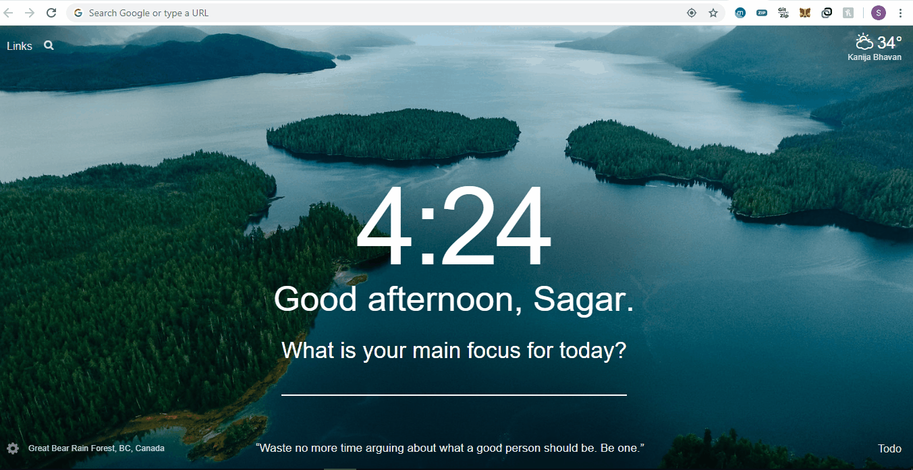

# Covid 19 Tracker
This is a ReactJS projects which was built using the MathdroAPI for keeping track of the number of COVID-19 cases in a country with a plot on daily active cases and deaths. This project aims at keeping the public informative.

Website : http://covid19globals.herokuapp.com/

Feel free to give a review !

## Demo

This project was bootstrapped with [Create React App](https://github.com/facebook/create-react-app).

